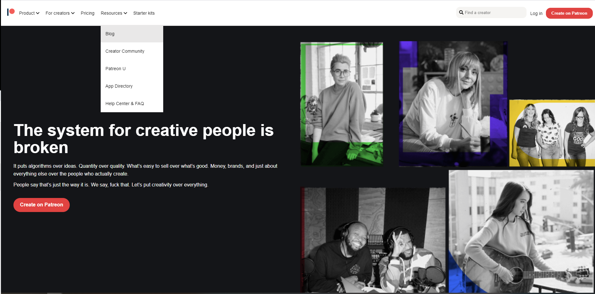

# Patreon UI clone
## Description: 
This is a responsive copy of [Patreon](https://www.patreon.com/europe)'s UI. 

## The outcome: 

## The Stack: 
The clone built with HTML & CSS only. It combines **CSS Grid** and **Flex Box**. 

## The version: 
Completed

## The online demo: 
[**DEMO**](https://vladimir-bogomolov.github.io/Patreon-clone/)
